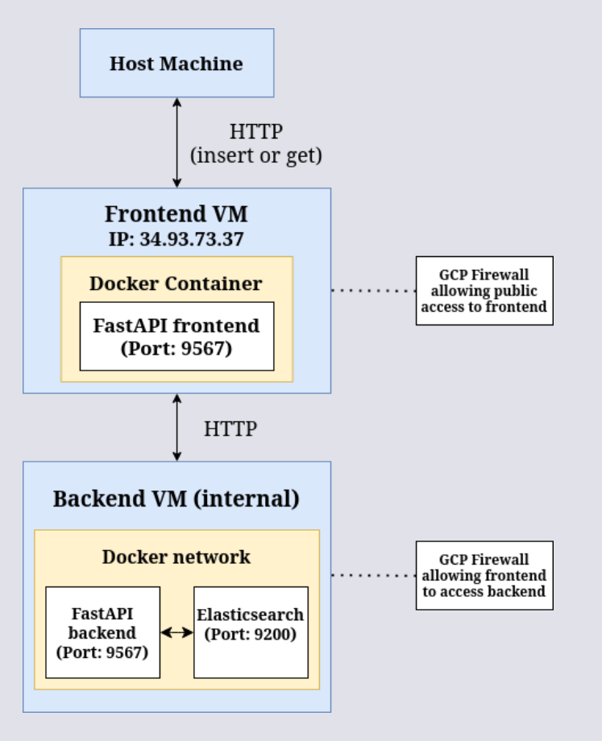

# Lab 08: Dockerized AI App Architecture - Image Descriptions

### Create frontend vm
Creating the frontend VM on Google Cloud Platform (GCP).

### Create backend vm
Creating the backend VM on GCP.

### VM creation done

Both VMs successfully created.

### Accessing vm via ssh

Accessing the VM using SSH from the browser.

### Creating frontend vm files

Creating required files for the frontend container.

### Frontend dockerfile

Dockerfile used for the frontend FastAPI app.

### Frontend main

Frontend FastAPI app's main.py file.

### Frontend requirements

Requirements file for the frontend FastAPI app.

### Frontend docker installation

Installing Docker on the frontend VM.

### Frontend docker installation

Installing Docker on the frontend VM.

### Backend main
Backend FastAPI app's main.py file.

### Backend files dockerfile requirements

Dockerfile and requirements for backend container.

### Backend docker installation
Installing Docker on the backend VM.

### Building frontend image

Building the Docker image for the frontend app.

### Building backend image and network

Creating Docker network and building backend image.

### Firewall page

Firewall rules page on GCP.

### Allow fastapi frontend
Creating firewall rule to allow public access to frontend.

### Allow frontend to backend
Creating firewall rule to allow frontend VM to access backend.

### Firewall rule creation done

All firewall rules successfully configured.

### Running elasticsearch

Running the Elasticsearch container.

### Running backend

Running the backend container.

### Running frontend

Running the frontend container.

### Netstat backend

Verifying open ports in backend VM using netstat.

### Netstat frontend

Verifying open ports in frontend VM using netstat.

### Frontend page access (global)

Accessing the frontend page from the browser.

### Example GET query

Performing a GET query from frontend.

### Example when query doesn't exist

Querying something that doesn't exist.

### Inserting new document

Inserting a new document using frontend.

### Query new document

Searching the document just inserted.

### Removing frontend

Removing the frontend container.

### Removing backend and elasticsearch

Removing backend and Elasticsearch containers.

### Running frontend

Running the frontend container.

### Running backend

Running the backend container.

### Documents are persistent

Verifying data persistence after container removal.

### Running images frontend

Docker image for frontend after build.

### Running images backend

Docker image for backend after build.

### Running inspect frontend

Docker inspect output for frontend container.

### Running inspect frontend

Docker inspect output for frontend container.

### Running inspect frontend

Docker inspect output for frontend container.

### Running inspect frontend

Docker inspect output for frontend container.

### Running inspect elasticsearch
Docker inspect output for Elasticsearch container.

### Running inspect backend
Docker inspect output for backend container.

### Running inspect network

Inspecting the custom Docker network used.

### Hub frontend
  
Docker Hub page with pushed frontend image.

### Hub backend

Docker Hub page with pushed backend image.

### Hub dashboard

Docker Hub dashboard with the images.

### Hub tags

Docker Hub tags for the images.

### Architecture diagram
Architecture diagram of the application.

### Optimization
For optimization of space and startup speed, we use the alpine base image (~5MB space).  
Also, instead of starting a shell (such as `bash`) when using CMD, we pass the list of arguments directly which decreases the overhead.  
We also pass the `--no-cache-dir` argument to pip to not store unnecessary cache files.
